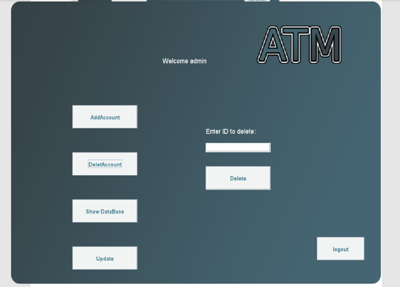
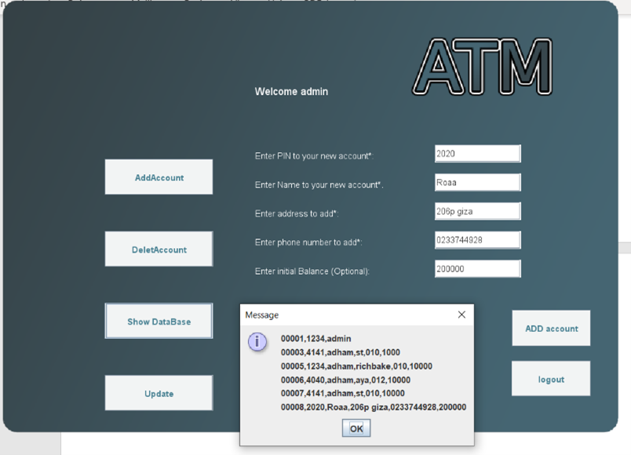
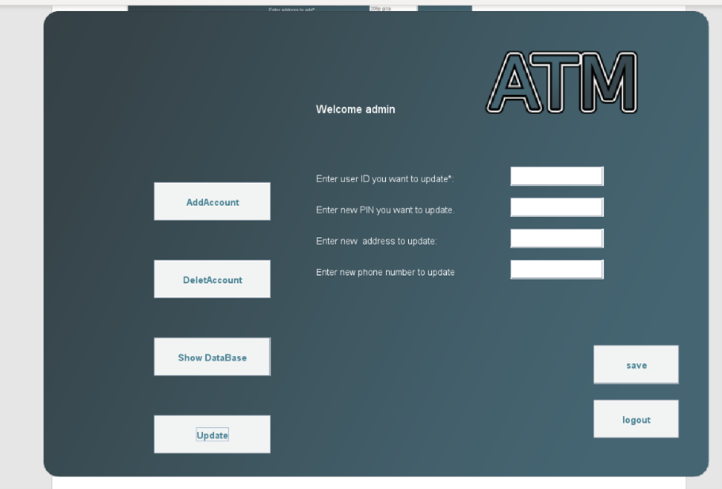
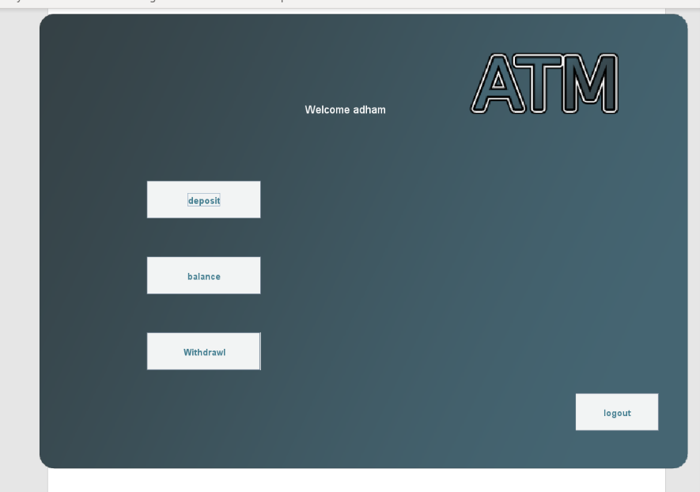
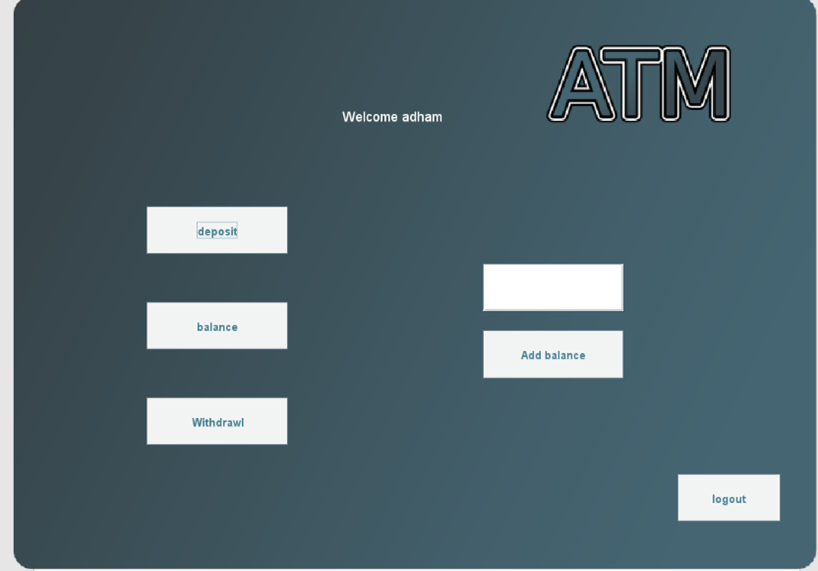
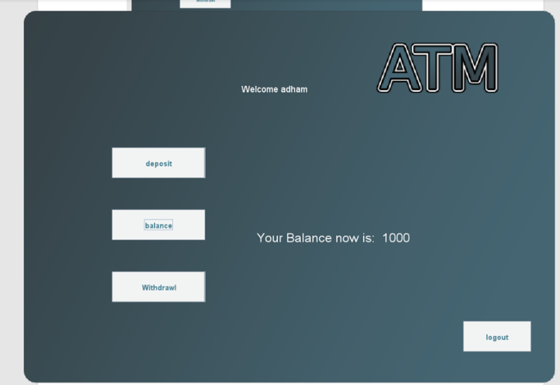
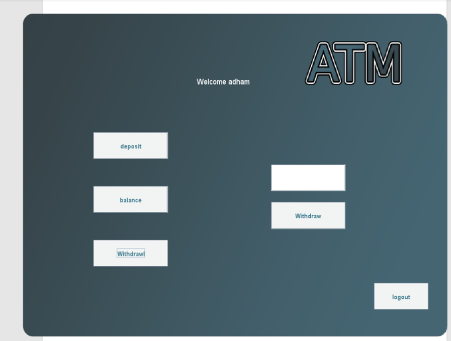

# ATM-System-Simulation

## This project consists of two main scripts:
### jframe.java
- This one contains the GUI for the ATM system and handles the credentials for admin and users.

### Project.java
- This script contains the backend, which handles the database, users privileges, encryption and decryption of the database.

#
**Home Page**

**To start as admin you should enter ( 00001 ) as ID and ( 1234 ) as PIN**

**The user must enter the same ID and PIN that are in the database --Example-- ⬇⬇⬇**

# 
**Admin page**

In admin page there are 4 functions:

1.	Add account 
2.	delete account 
3.	update 
4.	show data

1. Add account
   - to add an account you have to enter:
     - PIN
     - Name
     - Phone
     - Address
     - Balance
  

2. Delete account
   - To delete an account you have to enter id only.

3. Show database:
   - Display all data recorded in the database
   

4. Update
   - To update account data you have to enter ID and after that you can change:
     - PIN
     - Address
     - Phone
     

#
**User Page**

In user page there are 3 functions:

1. Deposit
2. Balance
3. Withdrawal

1. Deposit
   - This function adds balance to the signed in user account
  

2. Balance
   - It display the total balance for your account.

3. Withdrawal:
   - Withdraw balance from the signed in user account.

