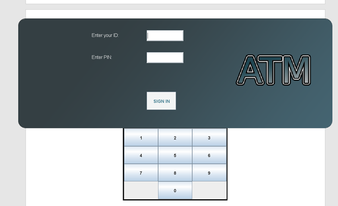
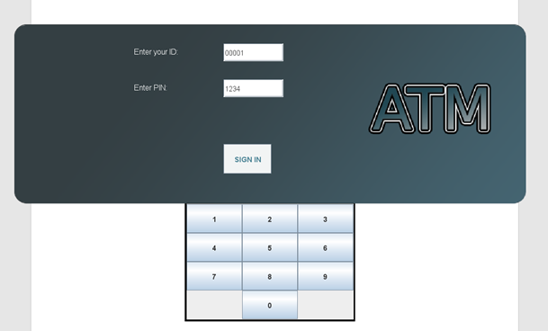
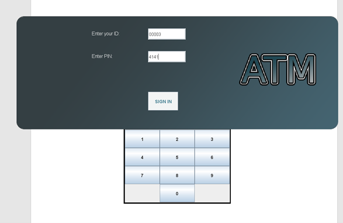
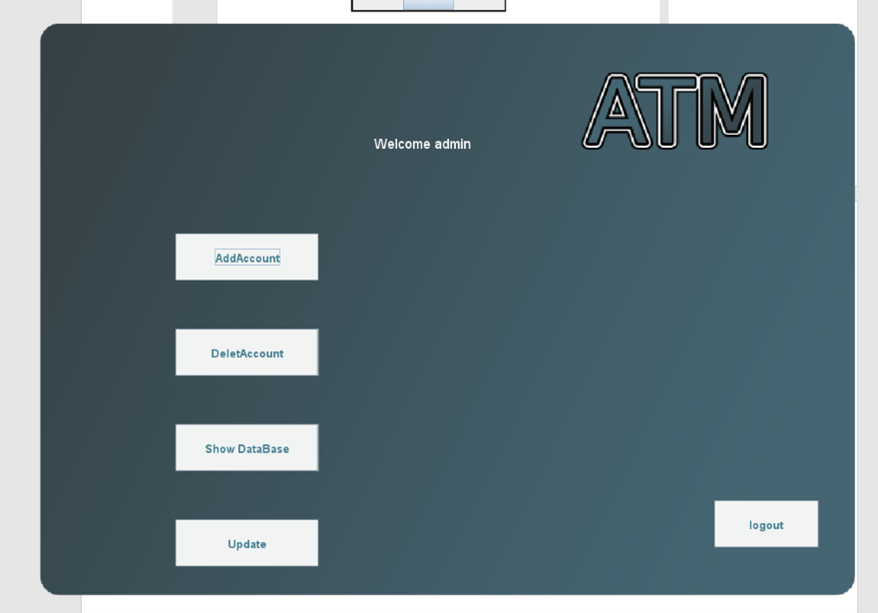
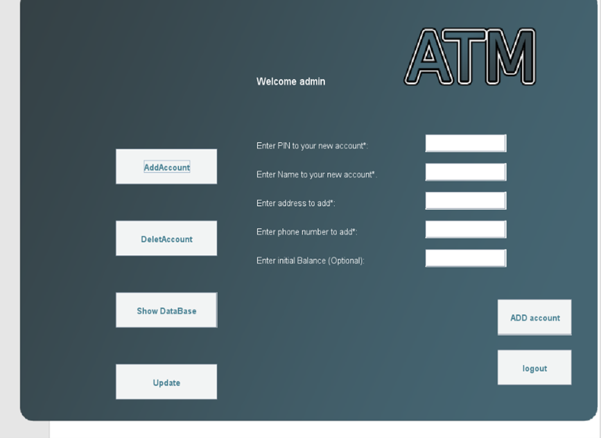

# ATM-System-Simulation

## This project consists of two main scripts:
### jframe.java
- This one contains the GUI for the ATM system and handles the credentials for admin and users.

### Project.java
- This script contains the backend, which handling the database, users privileges, encryption and decryption.

#
**Home Page**

**To start as admin you should enter ( 00001 ) as ID and ( 1234 ) as PIN**

**The user must enter the same ID and PIN that are in the database --Example-- ⬇⬇⬇**

# 
**Admin page**

In admin page we made 4 methods:

1.	Add account 
2.	delete account 
3.	update 
4.	show data

1. Add account
   - to add an account you have to enter:
     - PIN
     - Name
     - Phone
     - Address
     - Balance
  

